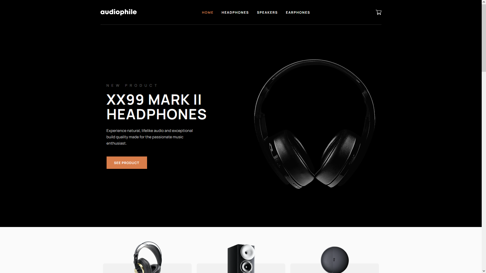

<!-- 🎧 Exciting News: Introducing my latest project, the Audiophile E-commerce Website! 🛒🎉

I'm thrilled to share with you all the results of countless hours of hard work and dedication. I've designed and built an audiophile e-commerce website that allows you to browse, shop, and purchase your favorite audio equipment with ease. 🎶

Key Features:

🛒 Seamless Shopping: Find your desired audio gear and purchase it effortlessly.
📦 Quantity Selection: Choose the quantity that suits your needs.
🛍️ Smooth Checkout Process: A hassle-free checkout experience for a quick and secure purchase.
🚀 Built with React, TypeScript, Formik, Tailwind CSS, and Framer Motion for a modern and dynamic user experience.
I'm passionate about audio quality, and I wanted to create a platform that caters to fellow audiophiles, providing a user-friendly and visually appealing shopping experience. The technologies used in this project ensure optimal performance and interactivity.

You can explore the website at [Insert Website URL] and experience the perfect harmony of high-quality audio and a smooth online shopping journey.

Thank you to everyone who supported me throughout this project. Your feedback and encouragement have been invaluable. If you have any questions or suggestions, please feel free to reach out. Your feedback is essential as I continue to improve and expand this platform.

#Audiophile #Ecommerce #WebDevelopment #React #TypeScript #Formik #TailwindCSS #FramerMotion #OnlineShopping #AudioEquipment

I'd appreciate it if you could visit the website and provide any feedback or suggestions. Your input will help me further enhance the user experience.

Feel free to personalize this post to include specific details about your project, such as the website URL or any unique features you've implemented. Sharing your project on LinkedIn is a great way to showcase your skills and connect with professionals who share your interests. -->

# Audiophile Ecommerce Website

  

# Getting Started

;

1. First of all you need to clone app repository from github:

```
https://github.com/Lazzzare/audiophile-ecommerce-website
```

2. Next step requires install all the dependencies.

```
npm install
```

3. Running the Project

```
npm run dev
```

# Links

- Solution URL: [GitHub Code](https://github.com/Lazzzare/audiophile-ecommerce-website)
- Live Site URL: [Live Site](https://audiophile-ecommerce-website-dun.vercel.app/)

# Built With

- _Vite_
- _React_
- _Typescript (TSX)_
- _TailwindCss_
- _sweetalert2_
- _React Hooks (useState, useEffect)_
- _framer-motion_
- _react-icons_
